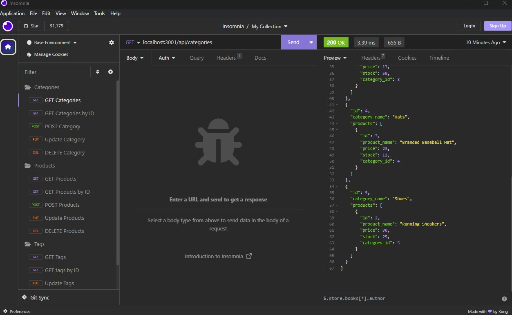

# ecomm-awesome

## Description
This application allows you to connect with your database of ecommerce products so that users are able to use the application and receive correct data.  

## Installation

You can access this code using the following link. (https://github.com/JBailey007/ecomm-awesome)

## Usage
In order to use this application you will need to do the following steps: 

Access MySQL in your terminal and login. Source the DB files (Schema) and then quit out of the mysql.

Run npm  run seed and then npm run start

You will then use Insomnia to make the appropriate calls to each of the routes that you need to access. 

A GET call that will access the Categories, Products and Tags. 

A GET by ID call that will access the Categories, Products and Tags by the ID they are associated with.

A POST call that will add an item to the Categories, Products and Tags.

An UPDATE call that will update the items in the Categories, Products and Tags. 

A DELETE call that will delete one of the items that you are calling from Categories, Products and Tags.

# Credits
N/A
element
# Demo

Demo Video - (https://drive.google.com/file/d/1hmJTOKStygaY-zIn3lC5SFmGCTANTLe6/view)

# Screenshot

## License
Please refer to the LICENSE in the repo. 